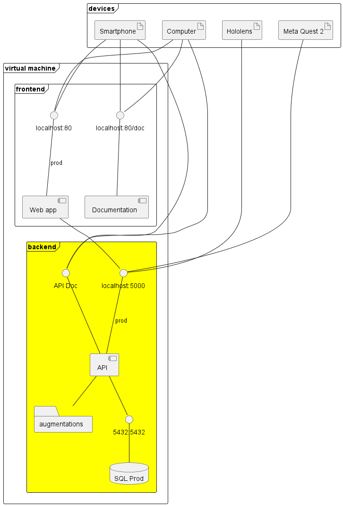

<h2 align="center">HELP - Web</h2>
<h3 align="center">Hybrid Extended Learning Platform - Web platform</h3>
<p align="center">
    <a href=""></a>
    <a href=""></a>
    <a href=""></a>
    <a href=""></a>
</p>

## Description
Hybrid Extended Learning Platform is a software package that aims to ease the creation of XR content for intructional usage. The principle is to use a unique web interface to design instructional activities with augmentations and access it throught AR ou VR client. 

## Component Description
This repository contains the source code for the API of the authoring tool. The API also includes a documentation generated by FastAPI. It is part of the HELP porject. The API is used in conbination with [HELP-web](https://github.com/ERPI-UL/HELP-web), [AR client](https://github.com/ERPI-UL/HELP-ARclient) and [VR client](https://github.com/ERPI-UL/HELP-VRclient).




## Instruction
This component use Docker to ease the deployment.
### Development mode

```sh
docker compose -f docker-compose.dev.yml up -d
```
### Production mode
```sh
docker compose -f docker-compose.prod.yml up -d
```

## Ackowledgment
The development of the tool that initiated this work was funded by the Grand Est region.